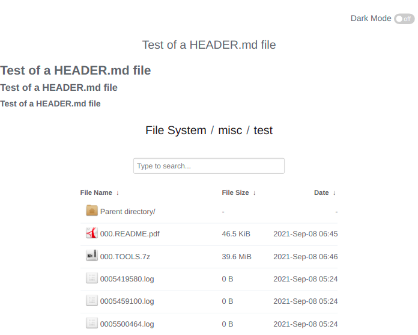
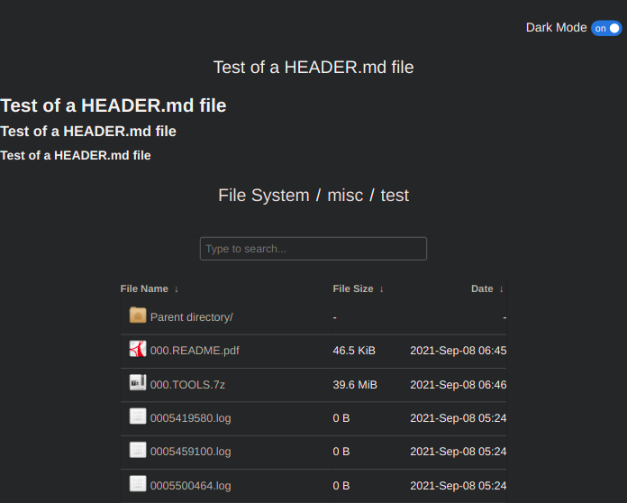

# Nginx-Fancyindex-Theme
A nginx fancyindex theme based on [Nginx-Fancyindex-Theme](https://github.com/Naereen/Nginx-Fancyindex-Theme)@Naereen.
Comes with updated [JQuery](https://jquery.com/) and [Marked.js](https://github.com/markedjs/marked/), a dark mode toggle, and file icons from ([Nginxy-Theme](https://github.com/lfelipe1501/Nginxy/tree/master/Nginxy-Theme/images/icons))@ifelipe1501.

The fancyindex module can be found [here](https://github.com/aperezdc/ngx-fancyindex) (by @aperezdc).
The fancyindex docker can be found [here](https://github.com/byjg/docker-nginx-extras) (by @byjg).

[](https://www.nginx.org/)


### Screenshots:



## Usage

1. Make sure you have the fancyindex module compiled with nginx, either by compiling it yourself or installing nginx via the full distribution (paquet `nginx-extras`).
2. Include the content of [fancyindex.conf](fancyindex.conf) in your location directive (`location / {.....}`) in your nginx config (usually `nginx.conf`).
3. Move the `.theme/` folder to the root of the site directory.
4. Restart/reload nginx.
5. Check that it's working, and enjoy!

## Configuration

A standard config looks something like this:

```bash
fancyindex on;
fancyindex_localtime on;
fancyindex_exact_size off;
# Specify the path to the header.html and foother.html files, that are server-wise,
fancyindex_header "/.theme/header.html";
fancyindex_footer "/.theme/footer.html";
# Making sure folder where these files are do not show up in the listing.
fancyindex_ignore ".theme";
fancyindex_name_length 255;
```

